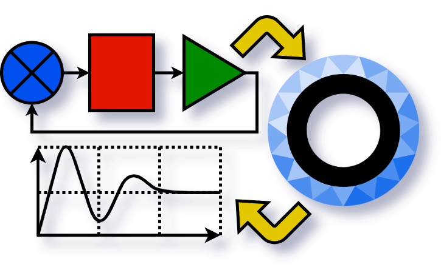

# Open3DE-ExtSimInt-Gem <!-- omit from toc -->



Open3D Engine gem providing interaction with external simulation model without ROS, via system Inter Process Communication (IPC): video output to external model/application and motion input from external application. Work is in progress yet, see [TODO \& current progress (dev branch)](#todo--current-progress-dev-branch).


## Contents <!-- omit from toc -->

- [Use](#use)
- [Development guidelines](#development-guidelines)
- [Links and resources](#links-and-resources)
- [TODO \& current progress (dev branch)](#todo--current-progress-dev-branch)

## Use

1. Create game project in O3DE Project manager on choose existing one.
2. Open project menu and select `Configure Gems...`
3. Open top right menu, choose `Add Existing Gem` and find this gem repository folder. Then save changes.

    <table style="border: 0px solid black;padding : 2px;">
        <tr style="border: 0px solid black;padding : 2px;">
            <td style="border: 0px solid black;padding : 2px;">
                
            </td>
            <td style="border: 0px solid black;padding : 2px;" rowspan="2">
                
            </td>
        </tr>
    </table>

4. Build project.

    <table style="border: 0px solid black;padding : 2px;">
        <tr style="border: 0px solid black;padding : 2px;">
            <td style="border: 0px solid black;padding : 2px;">
                
            </td>
            <td style="border: 0px solid black;padding : 2px;">
                
            </td>
            <td style="border: 0px solid black;padding : 2px;">
                
            </td>
        </tr>
    </table>

5. If build successful, `Open` project in O3DE Editor.
6. To use `ReceiveMotionParamsComponent`

   6.1. Choose entity you want to move.

   6.2. Add `ReceiveMotionParamsComponent` in `Add Component` dialog:

    <table style="border: 0px solid black;padding : 2px;">
        <tr style="border: 0px solid black;padding : 2px;">
            <td style="border: 0px solid black;padding : 2px;">
                
            </td>
            <td style="border: 0px solid black;padding : 2px;">
                
            </td>
        </tr>
        <tr style="border: 0px solid black;padding : 2px;">
            <td style="border: 0px solid black;padding : 2px;">
                
            </td>
        </tr>
    </table>

    6.3. Build and launch `examples/minimal_app`, choose IPC method (yet only `UDP`) in combobox, press start.

    6.4. Launch `Play Game` in O3DE Editor.

    

    (**Project, entities, level, assets are not included in this repo, used [copter 3D model](https://sketchfab.com/3d-models/dji-fpv-by-sdc-high-performance-drone-d471ea8c6235457b8e131842e2cf3783), terrain made by [tutorial1](https://docs.o3de.org/docs/learning-guide/tutorials/environments/create-terrain-from-images/) and [tutorial2](https://www.youtube.com/watch?v=rd8tEMUIEIY)**)

7. To use `TranslatePictureComponent`
   **`In progress yet`**
   **`TODO when ready`**

## Development guidelines

- To make development more automated, I recommend VS Code with [Microsoft C++ Estension Pack](https://marketplace.visualstudio.com/items?itemName=ms-vscode.cpptools-extension-pack).

- To generate IntelliSense hints when using O3DE classes, add path to O3DE SDK to extension paths in `.vscode\c_cpp_properties.json`

    <details>
    <summary>c_cpp_properties.json code sample</summary>

    ```
    {
        "configurations": [
            {
                ...
                "includePath": [
                    ...,
                    "<path>/<to>/<your>/O3DE/23.10.3/Code/**" // added this in VS C++ Extension to scan O3DE headers and generate IntelliSense hints
                ],
            }
        ],

    }
    ```
    </details>

    or do the same in VS Code C++ Extension dialog:

    <table style="border: 0px solid black;padding : 2px;">
        <tr style="border: 0px solid black;padding : 2px;">
            <td style="border: 0px solid black;padding : 2px;">
                
            </td>
            <td style="border: 0px solid black;padding : 2px;" rowspan="2">
                
            </td>
        </tr>
        <tr style="border: 0px solid black;padding : 2px;">
            <td style="border: 0px solid black;padding : 2px;">
                
            </td>
        </tr>
    </table>

- To build project with gems and components directly from IDE, create `.vscode/tasks.json` file, add two tasks based on lines from your O3DE Project Editor Cmake log and make them run in `Visual Studio Developer Command Prompt`, like in example below:
    <details>
    <summary>tasks.json code sample</summary>

    ```json
    {
        "version": "2.0.0",
        "windows": {
            "options": {
                "shell": { // run all tasks below in Visual Studio Developer Command Prompt !!!
                    "executable": "cmd.exe",
                    "args": [
                        "/C",
                        "\"C:/Program Files/Microsoft Visual Studio/2022/Community/Common7/Tools/VsDevCmd.bat\"",
                        "&&"
                    ]
                }
            }
        },
        "tasks": [
            { // Cmake configure task
                "type": "shell",
                "label": "O3DE Project configure",
                "command": "cmake",
                "detail": "CMake configure task, copy of O3DE Project manager command",
                "options": {
                    "cwd": "<!!! your/path/to/o3de_project>/YourProjectName"
                },
                "args": [ // made from original command line, shown in O3DE Project Manager Cmake Log 
                    "-B",
                    "<!!! your/path/to/o3de_project>/YourProjectName/build/windows",
                    "-S",
                    "<!!! your/path/to/o3de_project>/YourProjectName",
                    "-DLY_3RDPARTY_PATH=<!!! copy_from_your_cmake_log>"
                ]
            },
            { // Cmake build task, depends on configure
                "type": "shell",
                "label": "O3DE Project build",
                "command": "cmake",
                "detail": "CMake build task, copy of O3DE Project manager command",
                "options": {
                    "cwd": "<!!! your/path/to/o3de_project>/YourProjectName"
                },
                "args": [ // made from original command line, shown in O3DE Project Manager Cmake Log 
                    "--build",
                    "<!!! your/path/to/o3de_project>/YourProjectName/build/windows",
                    "--config",
                    "profile",
                    "--target",
                    "YourProjectName.GameLauncher",
                    "YourProjectName.ServerLauncher",
                    "YourProjectName.UnifiedLauncher",
                    "Editor"
                ],
                "dependsOn": "O3DE Project configure"
            },
        ]
    }
    ```
    </details>

## Links and resources

1. Open 3D Engine (O3DE) Tutorials and Examples. - URL: https://www.docs.o3de.org/docs/learning-guide.
2. Open 3D Engine and Atom API Reference. - URL: https://www.docs.o3de.org/docs/api.
3. Open 3D Engine (O3DE) User Guide. Components. - URL: https://www.docs.o3de.org/docs/user-guide/components.
4. Open 3D Engine (O3DE) User Guide. Gems in Open 3D Engine. - URL: https://www.docs.o3de.org/docs/user-guide/gems.
5. Your First Network Component. - URL: https://docs.o3de.org/docs/learning-guide/tutorials/multiplayer/first-multiplayer-component, https://github.com/SelfishOlex/O3DEBookCode2111.
6. Olex Lozitskiy. Game Programming with O3DE. - URL: https://o3debook.com.

API documentation yet is very poor and formal. For this reason it's often required to look into the source code:

7. O3DE. - URL: https://github.com/o3de/o3de/tree/development.

## TODO & current progress (dev branch)

- [x] Created the gem and 2 components from templates, added them to interface, successfully built and added them to entity in a project.
- [ ] 50% (UDP ready, shared memory yet `TODO`) External example app to translate motion parameters by IPC.
- [ ] 50% (UDP ready, shared memory yet `TODO`) Receiving motion parameters by IPC from external app and moving entity (`ReceiveMotionParams` component).
- [ ] Code to translate rendered picture by IPC  (`TranslatePicture` component).
- [ ] External test app to receive and display picture from `TranslatePicture` component.
- [ ] 50% Documentation
- [ ] Reliability, usability, optimization.

